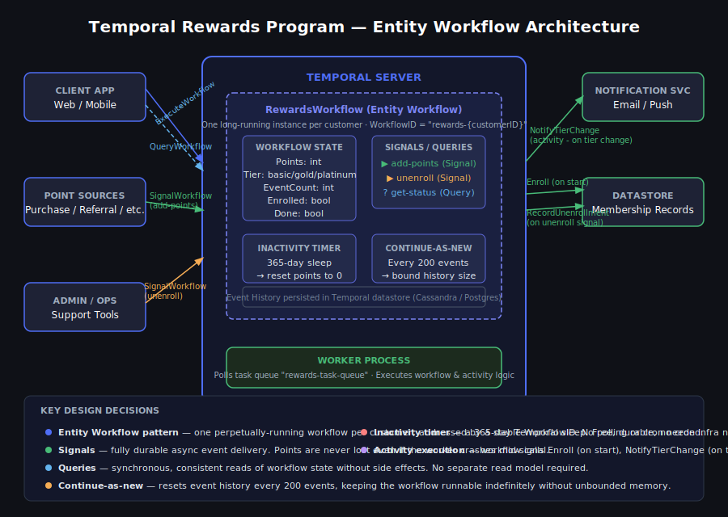

# Temporal Rewards Program

A customer loyalty rewards system built with [Temporal](https://temporal.io) using the Entity Workflow pattern. One long-running workflow per customer handles point accumulation and tier changes.



## What It Does

- Customers earn points from activities (purchases, referrals, etc.)
- Automatic tier upgrades: Basic → Gold (500pts) → Platinum (1000pts)
- Points reset after 365 days of inactivity
- Real-time status queries without database hits

## Quick Start

```bash
# Build
go build -o rewards ./cmd/rewards

# Terminal 1: Start Temporal
temporal server start-dev

# Terminal 2: Start worker
./rewards worker

# Terminal 3: Try it out
./rewards enroll customer-42
./rewards add-points customer-42 purchase 300
./rewards add-points customer-42 referral 250
./rewards status customer-42
```

## How It Works

**Entity Workflow**: Each customer gets one workflow (`rewards-{customerID}`) that runs continuously. The workflow maintains state in memory and responds to signals.

**Signals**: Add points or unenroll customers. Temporal queues these durably.

**Queries**: Get current tier/points instantly from workflow state.

**Activities**: Database writes and notifications happen in retriable activities with exponential backoff.

**Continue-as-New**: After 200 events, the workflow continues with fresh history to prevent unbounded growth.

**Idempotency**: Optional deduplication keys prevent double-counting points during retries.

**Versioning**: Workflow uses `GetVersion` for safe code changes to running workflows.

## Commands

```bash
rewards worker                                    # Start worker
rewards enroll <customerID>                       # Enroll customer
rewards add-points <customerID> <activity> <pts>  # Add points
rewards status <customerID>                       # Query status
rewards unenroll <customerID>                     # Unenroll
```

## Testing

```bash
go test ./... -v
```

Tests cover tier calculation logic, edge cases, and deduplication. See [ARCHITECTURE.md](ARCHITECTURE.md) for deeper design discussion.

## What's Stubbed

This is a POC. Activities log to console instead of hitting real databases or notification services. Search attributes use default custom fields instead of properly configured ones.

---

*Built with AI pair programming assistance for documentation and testing. Architecture and implementation are human-designed.*
